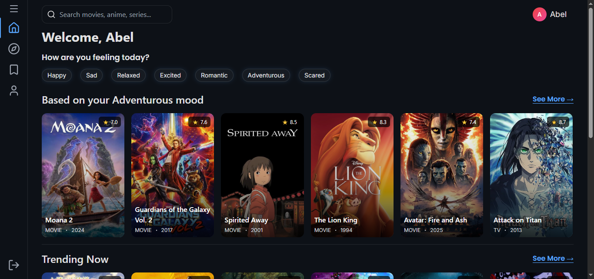
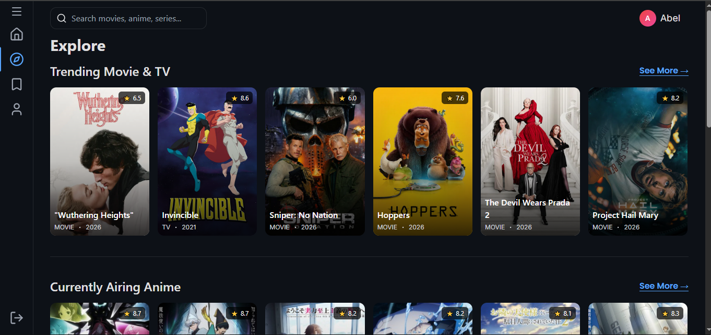
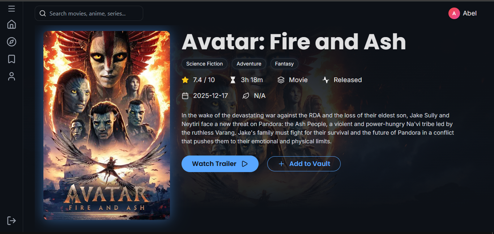
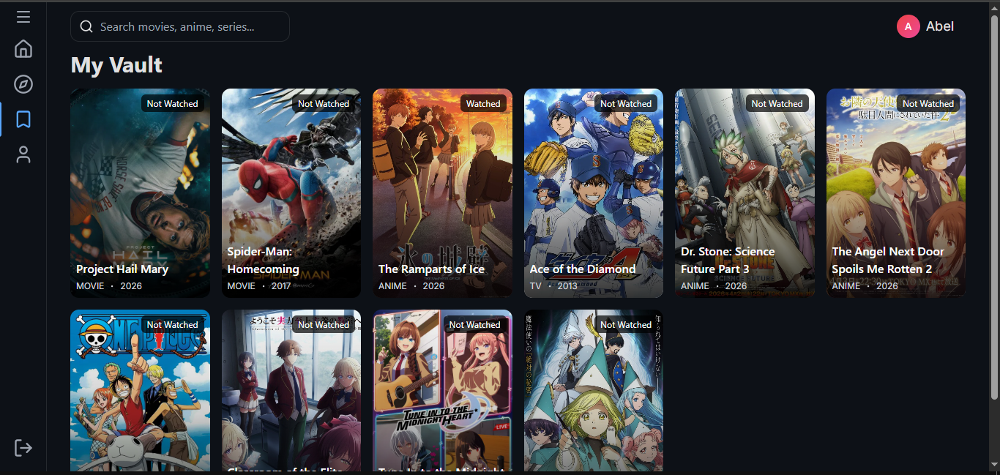
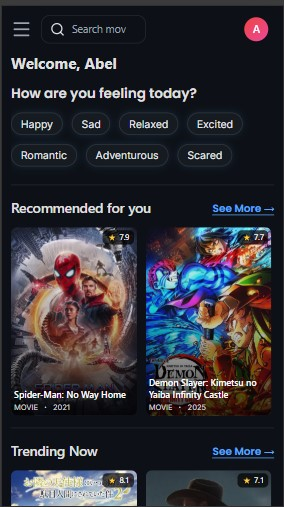

# 🎬 MoodVault

MoodVault is a **mood-based movie, TV show, and anime discovery app** that helps users find what to watch based on how they feel — and save it to their personal vault.

---

## 🚀 Live Demo

👉 https://moodvaultapp.vercel.app/

---

## ✨ Features

### 🎭 Mood-Based Discovery
- Discover movies, TV shows, and anime based on your mood (happy, sad, bored, etc.)
- Infinite scroll for continuous content discovery without interruptions

### 🤖 AI-Powered Personalization
- Smart recommendations powered by AI
- Adapts suggestions based on your mood and interaction patterns

### 🧠 Smart Vault Recommendations
- Get personalized suggestions based on what you’ve saved in your vault
- Your watchlist evolves into a recommendation engine over time

### 🔍 Explore Content
- Browse trending, popular, and top-rated movies, TV shows, and anime
- Clean and intuitive browsing experience

### 📄 Detailed View
- View ratings, genres, duration, and overview
- Watch trailers directly from the app

### 📦 Personal Vault
- Save and manage your watchlist
- Add or remove items anytime
- Persistent storage with Firebase

### 📱 Fully Responsive
- Optimized for mobile, tablet, and desktop
- Consistent UI across all screen sizes

### ⚡ Performance & UX
- Loading skeletons for smooth transitions
- Error handling and fallback states
- Optimized data fetching with caching

---

## 🛠 Tech Stack

- **Frontend:** React (Vite)
- **Styling:** Tailwind CSS
- **State & Data Fetching:** TanStack Query
- **Routing:** React Router
- **Backend Services:** Firebase Auth & Firestore
- **Icons:** Lucide React

---

## 📚 What I Learned

- Building scalable and reusable React component architecture
- Managing server state efficiently with TanStack Query
- Implementing authentication and real-time data with Firebase
- Designing fully responsive layouts using Tailwind CSS
- Handling real-world UI states (loading, error, empty, edge cases)
- Implementing infinite scroll for better user experience
- Integrating AI-based recommendation systems
- Designing personalized user experiences based on behavior and data

---

## 📸 Screenshots

<div align="center">

### 🏠 Home & 🔍 Explore



<br/><br/>

### 📄 Detail & 📦 Vault



<br/><br/>

### 📱 Mobile View


</div>

---

## ⚙️ Installation

```bash
git clone https://github.com/KirubelWondwossen/moodvault.git
cd moodvault
npm install
npm run dev
